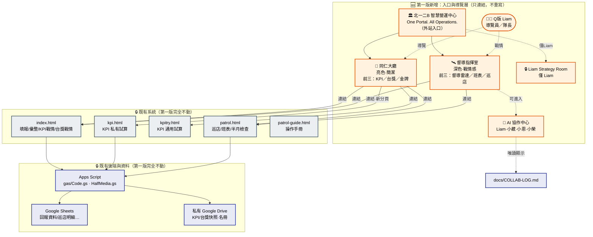
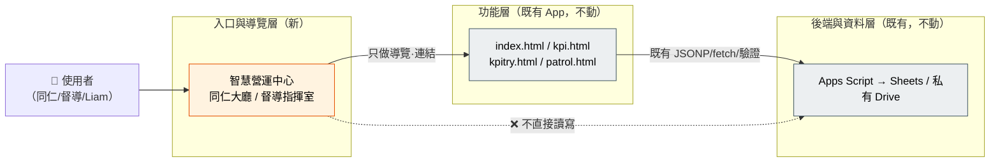

# 三、平台架構圖（草稿）

> **狀態：草稿｜作者：小恩｜日期：2026-07-23**
>
> **本圖最重要的一句話：**
> ## 🔑 第一版只新增「入口與導覽層」，不取代、不重寫任何既有資料與功能。

---

## 3.1 全景圖（Mermaid）



---

## 3.2 資料流關係圖（強調：入口層不碰資料）



> **關鍵：入口層與後端之間是「❌ 不直接讀寫」的斷開關係。** 所有資料存取仍走既有 App 自己的既有路徑（JSONP / fetch / 裝置綁定 / M365 / PT_KEY），入口層不新增任何後端連線。

---

## 3.3 分層責任表（文字版，供不看圖時參照）

| 層 | 內容 | 第一版狀態 | 誰負責 |
|---|---|---|---|
| **入口與導覽層** | 智慧營運中心、同仁大廳、督導指揮室、AI 協作中心、Liam Strategy Room、Q版 Liam | 🆕 新增（只連結） | 小榮開發，小恩定規格 |
| **功能層** | index.html / kpi.html / kpitry.html / patrol.html / patrol-guide.html | 🔒 不動 | 既有 |
| **後端層** | Apps Script（Code.gs / HalfMedia.gs） | 🔒 不動 | 既有 |
| **資料層** | Google Sheets、私有 Google Drive、localStorage | 🔒 不動 | 既有 |

---

## 3.4 導覽階層圖（純文字樹）

```
北一二B 智慧營運中心（外站入口）
│
├── 👥 同仁大廳（亮色·簡潔）
│   ├── [前1] KPI ────────────→ 連結 kpi.html / index.html KPI戰情（待確認）
│   ├── [前2] 台獎 ───────────→ 連結 index.html 台獎戰情（待確認）
│   ├── [前3] 金牌 ───────────→ ⚠️ 待確認功能來源
│   ├── 試算表 ───────────────→ 連結 kpitry.html / kpi.html（待確認）
│   ├── 店務檢查（日）─────────→ 連結 patrol.html 巡店明細
│   ├── 店務檢查（半月）───────→ 連結 patrol.html 半月檢查
│   ├── 店務檢查（每月）───────→ 連結 patrol.html 每月項目
│   ├── 公告 ─────────────────→ ⚠️ 待確認功能來源
│   └── 常用工具 ─────────────→ 連結集合頁
│
├── 🛰️ 督導指揮室（深色·戰情感）
│   ├── [前1] 督導雷達 ────────→ ⚠️ 待確認功能來源
│   ├── [前2] 班表 ───────────→ 連結 patrol.html 每月班表（M365）
│   ├── [前3] 巡店 ───────────→ 連結 patrol.html 巡店/督導檢查大盤
│   ├── 資費分析 ─────────────→ 🟪 未來規劃
│   ├── 上線分析 ─────────────→ 🟪 未來規劃
│   ├── KPI 深度分析 ─────────→ 🟪 未來規劃
│   └── AI 協作中心（入口）────→ 見下
│
├── 🤖 AI 協作中心
│   ├── 角色卡：Liam / 小葳 / 小恩 / 小榮
│   └── 唯讀顯示：docs/COLLAB-LOG.md（建議）
│
└── 🔒 Liam Strategy Room（僅 Liam）
    ├── 管理策略 / 未完成事項 / AI 工作規劃
    ├── 開發進度 / 想法 / 私人筆記
    └── 最終決策紀錄
        （版面+佔位，第一版不接資料）
```

---

## 3.5 邊界聲明（Boundary Statement）

1. 入口層是**加法**，不是**替換**：現有網址、頁面、資料一個都不移動。
2. 入口層對後端是**唯讀的旁觀者**：它連 Sheets/Drive 都不碰，最多只「顯示 COLLAB-LOG 這種公開文字」。
3. 若第一版任何入口找不到既有功能可連（金牌/公告/督導雷達），一律**先放佔位卡＋「待 Liam 確認」**，不自行新建功能。
